Exercise 1: Creating docker images for NGINX Plus
=================================================

In this lab exercise, we will automate building NGINX Plus Docker
containers, on various Linux base images, from custom and optimized
Dockerfiles, we will test the Docker container is functional before
pushing it to our private container registry. Our Docker containers are
then available for any application developer to pull and use for any
NGINX Plus based deployments!

[Docker](https://www.docker.com/) is an open platform for building,
shipping, running, and orchestrating distributed applications. As
software applications, the open-source NGINX product and the enhanced
and commercially supported version, NGINX Plus, is an excellent use case
for Docker because it is feature-rich, deployable on many Linux
distributions and is less than 2.5mb in size.

While NGINX open-source images are available on [Docker
Hub](https://registry.hub.docker.com/), the repository of Docker images,
the repository of Docker images, you are required to build your own
NGINX Plus docker images and store them in your **private** container
registry, due to License keys requirement activate NGINX Plus

For more information about Docker, see [What is
Docker?](https://www.docker.com/whatisdocker/) or bookmark the full
[Docker documentation](https://docs.docker.com/) for reference

### CICD flowchart

**The diagram below depicts the workflow from code to deployment.** Our
exercise ends with pushing the docker image to the container registry
but could easily be extended to deploy a container with new application
code to a live environment


-------------------------------------------------------------------------
> **Important: Run all lab activites from the Windows JumpHost**
-------------------------------------------------------------------------

### Task 1: Run a pipeline to build NGINX Plus images

1.  Double-click on the **GitHub Desktop** shortcut on the desktop. It
    will open up the **GitHub Desktop Client** application. GitHub
    Desktop client is an excellent easy to use tool to manage your code
    on git repositories. **GitHub Desktop** is developed by GitHub, Inc.
    but can be used on any git-based project

    

2.  Once GitHub Desktop Client is open, verify in the upper left corner
    that **nginx-plus-dockerfiles** is selected as the **current
    repository**. If it is not, click the drop-down button, and select
    **nginx-plus-dockerfiles**. Once you have the correct repository
    selected, click on **Open in Visual Studio Code** on the right side
    of the application

    

3.  Inside the project folder, you will see many subfolders containing
    Dockerfiles to various builds of NGINX Plus on [supported Linux
    distributions](https://docs.nginx.com/nginx/technical-specs/). Take
    some time to inspect the Docker files in different folders found in
    the project

    

4.  Lets take a look a a `Dockerfile`. For example, look at the **alpine3.10** 
    folder, and in here, you will find a the `Dockerfile` for a NGINX Plus
    build for [Alpine Linux](https://alpinelinux.org) version 3.10.
    At the top of each `Dockerfile`, there is a line starting with the 
    command `FROM`. The first `FROM` command is a critical Docker command that
    allows you to pull dependencies from other images. You typically find 
    the next command sets the `maintainer` of the image, for reference and 
    information. For more details on `Dockerfile`, check out [Dockerfile Reference](https://docs.docker.com/engine/reference/builder/). 

   > NGINX Plus now supports the newer `3.11` version of Alpine linux.
    Let's create add the creation of a NGINX Plus build for Alpine Linux 
    version 3.11 to our CICD pipeline.

5.  Create a new folder called `alpine3.11` in this project under the 
    `Dockerfiles` root folder.

    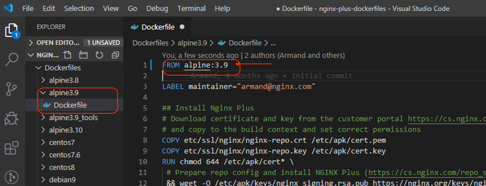
    

6.  Let's use the **Alpine 3.10** `Dockerfile` as a template for our new
    **Alpine 3.11** build. Go ahead and copy the `Dockerfile` in the 
    `alpine3.10` folder and paste it into the empty `alpine3.11` folder.
    You can use `Right Click over Alpine3.10 > **Dockerfile** > Copy`, 
    then `Right Click over Alpine3.11 Folder > Paste`.

    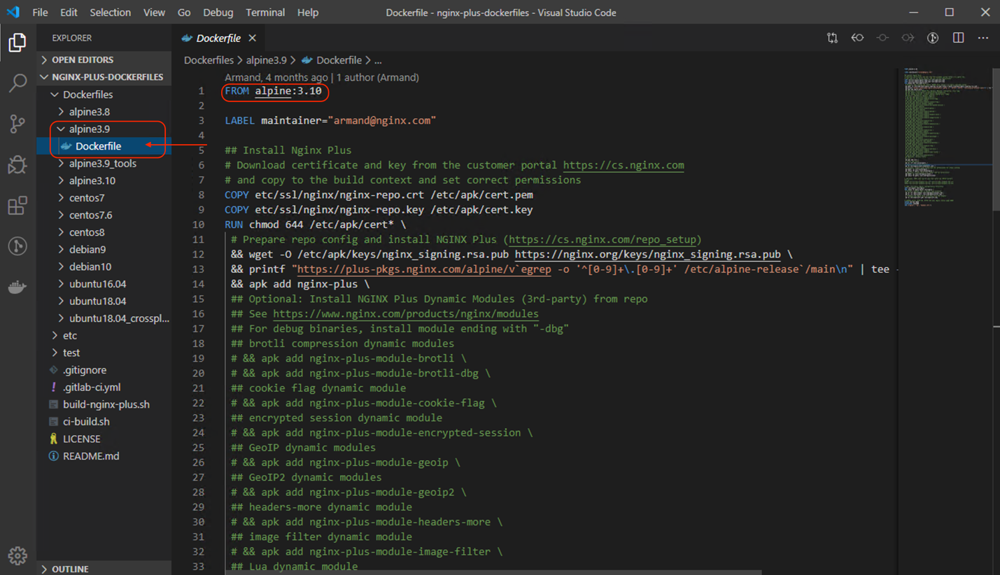
    

7.  In order to build a **Alpine 3.11** image, we need to edit the copied 
    `Dockerfile` in out `alpine3.11` folder, and update the `FROM alpine:3.10` 
    command to `FROM alpine:3.11`

    
    

8.  Once you have edited `Dockerfile` and replaced the `FROM alpine:3.10` 
    command to `FROM alpine:3.11`, go ahead and **save** the
    file. You can navigate to `file` -> `save` or you can use the shortcut,
    **CTRL+S**.

-------------------------------------------------------------------------
> Now we have created a Dockerfile for Alpine 3.11 but still need to
> create a new **Stage** in our GitLab CI/CD Pipeline Configuration file,
> [`.gitlab-ci.yml`](https://gitlab.f5demolab.com/f5-demo-lab/gitlabappster/-/blob/master/.gitlab-ci.yml)
-------------------------------------------------------------------------

9.  In order to build a **Alpine 3.11** image, we also need to add a new stage
    to our `.gitlab-ci.yml` file for `alpine3.11`. Open this project's GitLab 
    CI/CD Pipeline Configuration file, `.gitlab-ci.yml` and find the stage 
    labeled `alpine3.10` (use Find **Ctrl+F**). 
    
    a. Go ahead and **Copy (Ctrl+C)** this stage, and **Paste (Ctrl+V)**
    it underneath the existing `alpine3.10` stage.

    b. Lastly, edit the stage label `alpine3.10` to `alpine3.11`

-------------------------------------------------------------------------
> **Important:** The correct indentation in a `yaml` file must be valid and
> make sure your `.gitlab-ci.yml` file looks like the example above.
-------------------------------------------------------------------------

10. Once you have edited `.gitlab-ci.yml` and created the new `alpine3.11` 
    stage, go ahead and **save** the file. You can navigate to `file` -> `save` 
    or you can use the shortcut, **CTRL+S**.

11.  Open or switch back to GitHub Desktop Client, and you will now see
    the changes made.

    The GitHub Desktop Client has automatically tracked the changes that
    were made to the project folder, and is highlighting those exact changes,
    "2 changed file: `.gitlab-ci.yml` and `Dockerfiles\alpine3.11\Dockerfile`"

12. We are now going to push these changes to our repository on GitLab.
    In the lower-left of the GitHub, Desktop Client provide a
    **Commit title** and **note** before we can commit to master.

    You can see two boxes. Go ahead and type in the **title** field:
    `"Alpine 3.11"`. 

    Additionally, you can provide notes as well, type in the **notes** field:
    `"NGINX Plus for Alpine 3.11"`

    Once you fill in both boxes, click on **Commit to Master** and on
    the next screen, press **"Push to Origin"** to push the new code
    commit to our git repository on Gitlab.

    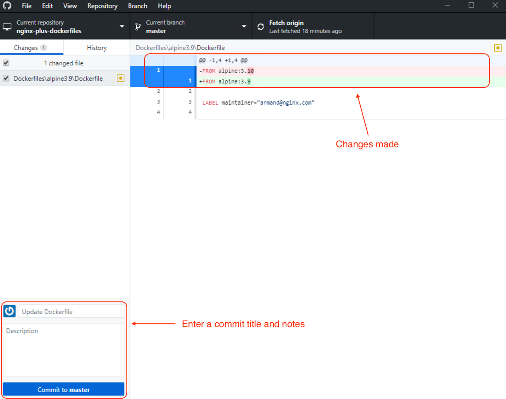

    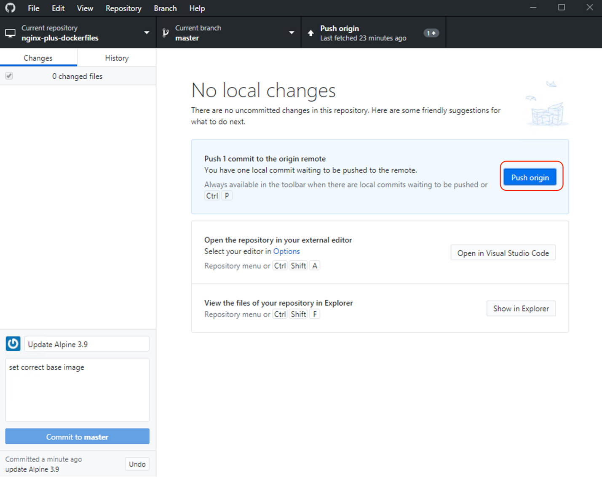

13.  Open up the **nginx-plus-dockerfiles** repository on
    Gitlab, [`https://gitlab.f5demolab.com/f5-demo-lab/nginx-plus-dockerfiles`](https://gitlab.f5demolab.com/f5-demo-lab/nginx-plus-dockerfiles) or using
    the **"nginx-plus-dockerfiles"** shortcut provided. This will take
    us to the repository where we just pushed our modified Docker file
    to

    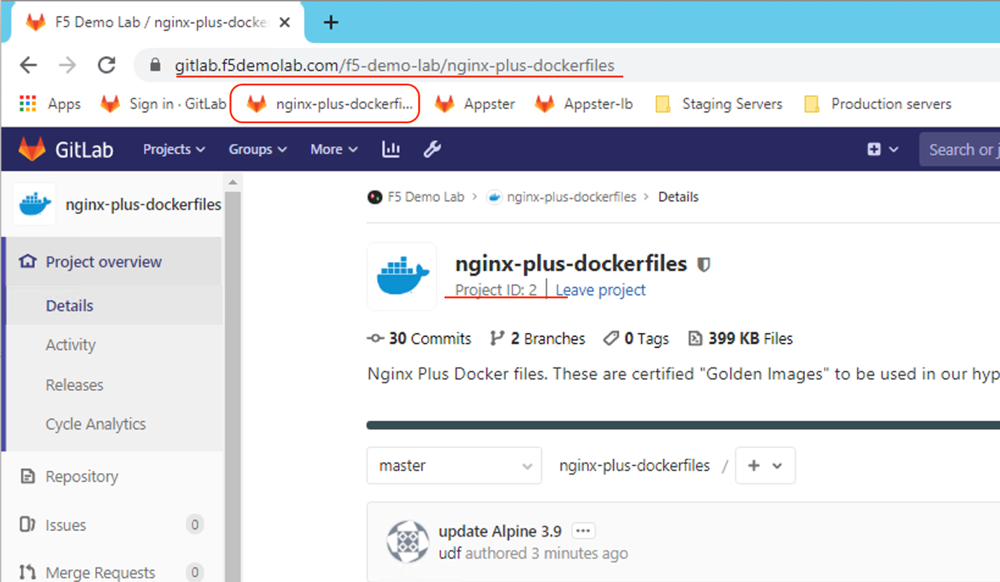

14. On this **nginx-plus-dockerfiles** repository page, you will see the
    pipeline status icon next to the latest **Commit SHA**. When the
    pipeline currently in progress, you will see an **orange icon** 
    (waiting to start) or **blue circle** (running). Hopefully,
    we don't see a **red icon**, which indicates the pipeline has
    failed. We can click on the pipeline status icon to view the
    pipeline progress

    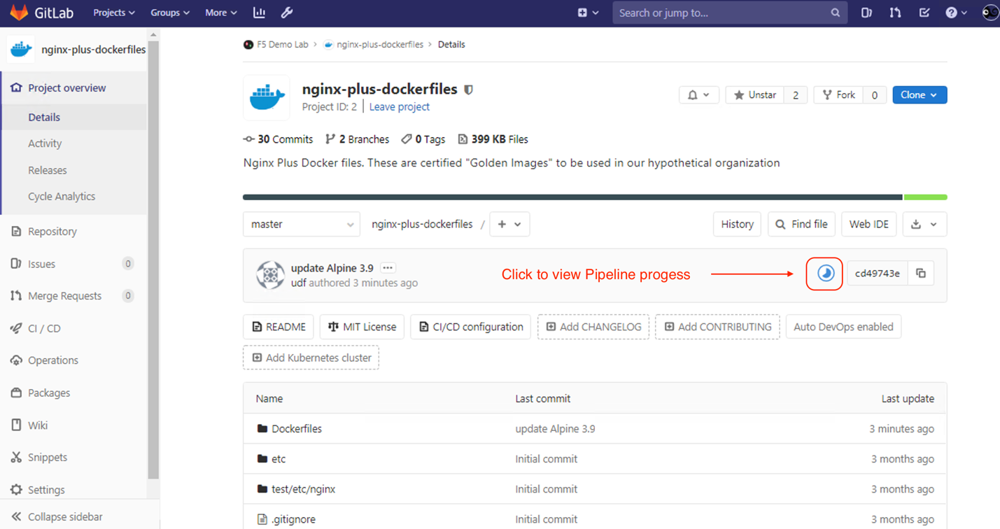

    The next screen shows a high-level view of the pipeline triggered for
    this commit. We can click on the pipeline status icon on this screen to
    view the pipeline progress in greater detail.

    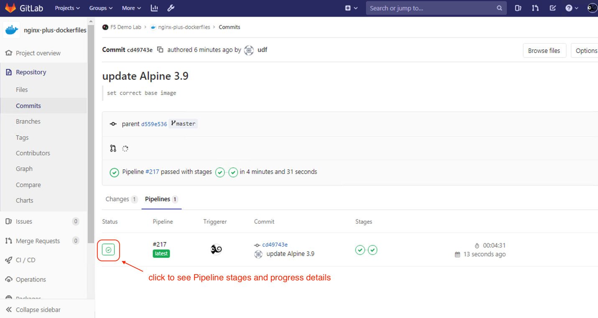

15. After clicking on the pipeline status icon, we can view the full
    pipeline. As you can see, we can now see our
    pipeline: **BUILD** and **CLEANUP.** This pipeline was automatically
    triggered after we submitted our changes to Dockerfile (when we
    clicked **'push origin.'**) and we can see at a high level the
    stages in the pipeline progressing and the final result

    If all stages were successful, then we should have updated our Docker
    images up to our Docker container registry on this repository.

    

16. A Docker Container Registry is integrated into GitLab, and every
    project can have its own space to store its Docker images. We can
    see our image in the **Package** **>** **Container Registry**. 
    On the Container Registry page, expand the title, and
    you will see a list of Docker images ready for use

    Here you should see your new **alpine3.11** image

    

### Task 2: GitLab CI/CD environment variables

Environment variables are a powerful feature provided by Gitlab that is
useful for customizing your jobs in GitLab CI/CD's pipelines. Using
variables means no hardcoded values and prevents sensitive secrets from
getting exposed in the code or logs. There are two types of variables in GitLab:

1.  [**Predefined environment variables**](https://docs.gitlab.com/ee/ci/variables/#predefined-environment-variables):
    GitLab CI/CD has a [default set of predefined variables](https://docs.gitlab.com/ee/ci/variables/predefined_variables.html) that
    can be used without any specification needed. You can call issues,
    numbers, usernames, branch names, pipeline and commit IDs, and much
    more.

2.  [**Custom environment variables**](https://docs.gitlab.com/ee/ci/variables/#custom-environment-variables):
    When your use case requires a specific custom variable, you can [set them up quickly from the UI](https://docs.gitlab.com/ee/ci/variables/#creating-a-custom-environment-variable) or
    directly in the `.gitlab-ci.yml` file and reuse them as you wish.
    There are two variable types:
    -   [**Variable type**](https://docs.gitlab.com/ee/ci/variables/#variable-type):
        The Runner will create an environment variable named the same as
        the variable key and set its value to the variable value.
    -   [**File type**](https://docs.gitlab.com/ee/ci/variables/#file-type):
        The Runner will write the variable value to a temporary file and
        set the path to this file as the value of an environment
        variable, named the same as the variable key

-------------------------------------------------------------------------
> Let's take a look at variables used in our lab ...
-------------------------------------------------------------------------

1.  Navigate to the
    Gitlab [**nginx-plus-dockerfiles**](https://gitlab.f5demolab.com/f5-demo-lab/nginx-plus-dockerfiles) **repository** **>**
    **Settings** **>** **CI/CD**. Once on that screen, expand **Variables**. Here
    you can see we have pre-configured variables

    The following variables are the NGINX Plus certificate and key files in
    PEM format, used in our CI/CD pipeline:

    -   `NGINX_REPO_CRT`
    -   `NGINX_REPO_KEY`

    We have prepopulated the contents of both variables into the
    `VALUE` field, and it is as a string in CICD Pipeline jobs.

    **Note:** We cannot set these values with a `Masked` type because
    our NGINX PEM files do not meet
    the Base64 alphabet (RFC4648) format [requirement](https://docs.gitlab.com/ee/ci/variables/#masked-variables). 
    We want to make sure we do not [`echo`](https://linux.die.net/man/1/echo) that value in any of the Pipeline logs

    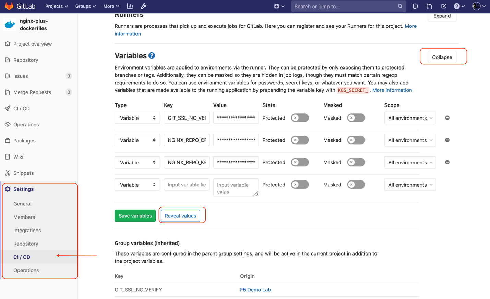

2.  Let's take a look at that variable in action: Open a log output
    of a recent successful pipeline job from the sidebar menu, go to 
    **CICD > Jobs** and click on a **status: passed** icon associated with a
    to a image build stage, any stage with name with a linux distro name 
    e.g. `ubuntu18.04` **(not `clean_up`)**

    

3. Use the web browser's FIND (Ctrl + F) function to find `$NGINX_REPO_CRT`
   and you will find the following output: 
    ```bash
    echo "NGINX_REPO_CRT" > "etc/ssl/nginx/nginx-repo.crt"
    echo "NGINX_REPO_KEY" > "etc/ssl/nginx/nginx-repo.key"
    ```

    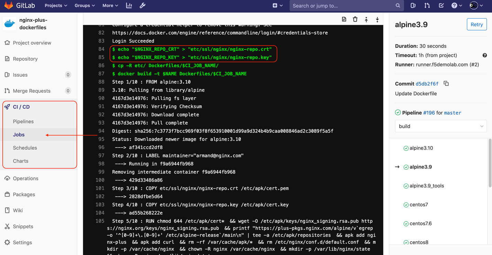

4.  **FYI and Troubleshooting only:** If the CI Pipeline fails due to invalid 
    or expired licenses, we will expect the **nginx-plus-dockerfiles** 
    pipeline to fail since NGINX Plus requires valid licenses to install 
    NGINX Plus. The errors in the pipeline job will show this error too.

    **ASK YOUR INSTRUCTOR** for a new NGINX Plus Certificate and Key
    
    Copy and paste your new valid PEM keys, **`nginx-repo.key`** and 
    **`nginx-repo.crt`**, in the value fields and then press the Save variables button.

    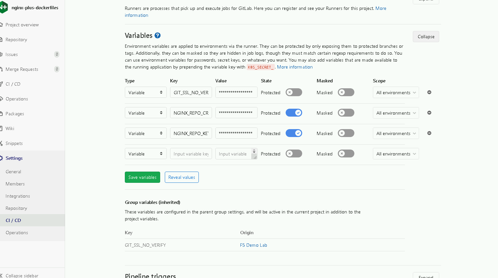
    
    

### Task 3: Pull and run a Docker image from our private Docker Registry

This task is an excellent opportunity to practice basic Docker commands
if you are unfamiliar with how to get up and to run Docker containers or
want some practice.

We will pull an image from our private docker registry, run a container,
and use volumes to persist data.

Note: For more self-paced, hands-on-tutorial, try out the [Docker 101
tutorial](https://www.docker.com/101-tutorial)

1.  Open an SSH Shell to the Staging Server using **git bash for windows**. 

    Git Bash is a bash shell emulator, similar to what you see
    natively on Linux and Unix machines. If the git console font is too
    small to read, use **Ctrl+ "+"** to increase the font

    Once **git bash for windows** is open, run the following command to SSH into the Staging server:

    ```bash
    ssh centos@10.1.1.11
    ```

    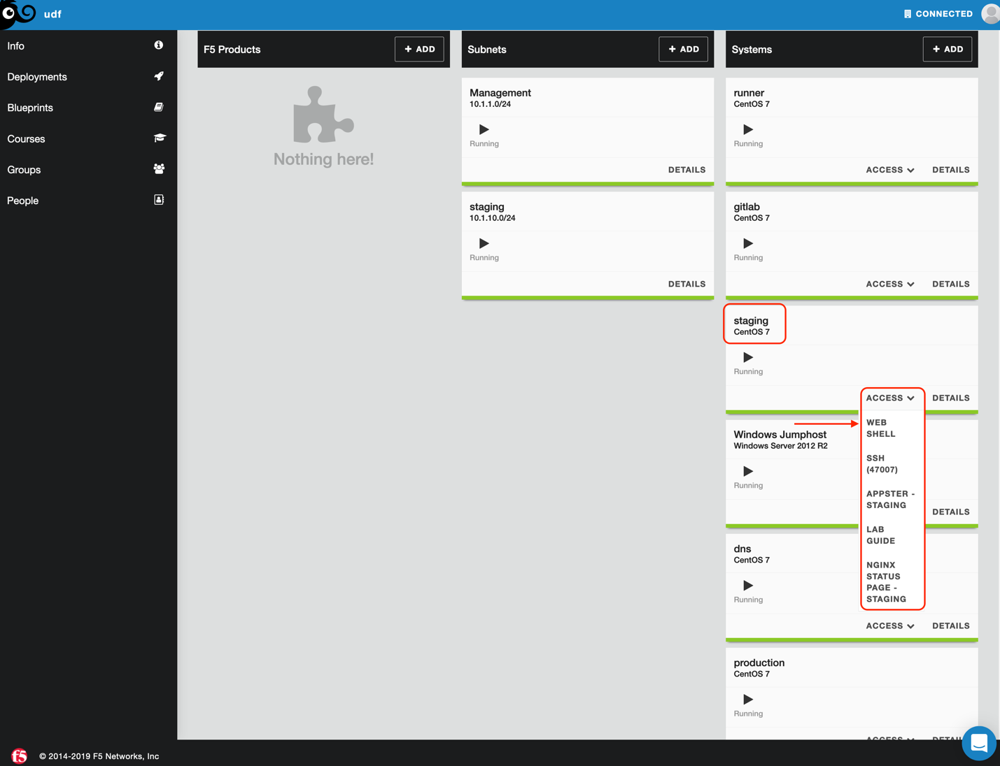

2.  The web shell will open as `centos` user. Make sure you are in in the provided project
    folder with NGINX Plus configurations in `/home/centos/nginx-plus-docker-base`

    ```bash
    $ whoami
    centos

    $ cd ~/nginx-plus-docker-base
    $ pwd
    /home/centos/nginx-plus-docker-base
    ```

3.  Pull an image from our private docker registry using the `docker pull` command.
    Run the following command below to pull our NGINX Plus image built on **Alpine Linux 3.10**, 
    if you want to run another image, you can copy the Docker image location from the Gitlab
    Container registry page from the **nginx-plus-dockerfiles** repository

    

    ```bash
    $ docker pull registry.gitlab.f5demolab.com/f5-demo-lab/nginx-plus-dockerfiles:alpine3.10
    alpine3.10: Pulling from f5-demo-lab/nginx-plus-dockerfiles
    4167d3e14976: Already exists
    d515ef1b2c63: Pull complete
    72886512006a: Pull complete
    7f39e3ca1721: Pull complete
    ea3c7cd8c3af: Pull complete
    7385769c7c40: Pull complete
    Digest:
    sha256:400dd9e21e963629fc3d974261b1b6668b5c822009ddb183ddaa0631c2ae4165
    Status: Downloaded newer image for
    registry.gitlab.f5demolab.com/f5-demo-lab/nginx-plus-dockerfiles:alpine3.10
    registry.gitlab.f5demolab.com/f5-demo-lab/nginx-plus-dockerfiles:alpine3.10
    ```

4.  Run a container using the downloaded docker image from the previous
    step. We will also map ports `9000` and `9080` on the docker
    host to ports `80` and `8080` on the container, and also mount
    the local nginx configurations to the container

    ```bash
    $ docker run -d -p 9000:80 -p 9080:8080 -v $PWD/etc/nginx:/etc/nginx \
    registry.gitlab.f5demolab.com/f5-demo-lab/nginx-plus-dockerfiles:alpine3.10

    c3dbc2f22505bf7e7eb863ff9f548121b1daa5eb18b1279b656e8c034dc540f2
    ```

5.  You can see the container is running on the mapped ports. When
    running `docker ps` you may see it running alongside other
    containers. The first value is the `CONTAINER ID` we will need
    this value later to shut down the container


    ```bash
    $ docker ps

    CONTAINER ID IMAGE COMMAND CREATED STATUS PORTS NAMES
    c3dbc2f22505
    registry.gitlab.f5demolab.com/f5-demo-lab/nginx-plus-dockerfiles:alpine3.10
    "nginx -g 'daemon of..." 50 seconds ago Up 49 seconds 443/tcp,
    0.0.0.0:9000->80/tcp, 0.0.0.0:9080->8080/tcp sleepy_colden
    ```

6.  We can now test the NGINX Plus container by making a HTTP request
    using `curl`. We should get our test reponse page back:

    ```bash
    $ curl http://127.0.0.1:9000 -L
    Status code: 200
    Server address: 127.0.0.1:8096
    Server name: c3dbc2f22505
    Date: 04/Mar/2020:17:36:06 +0000
    User-Agent: curl/7.29.0
    Cookie:
    URI: /
    Request ID: 6ab36225f5a958350154a90da2145030
    ```

7.  After finishing testing, we can now stop the container using `docker stop [CONTAINER ID]`.
    To find the `CONTAINER ID` of `registry.gitlab.f5demolab.com/f5-demo-lab/nginx-plus-dockerfiles:alpine3.10` again, run `docker ps`.

    ```bash
    $ docker ps

    CONTAINER ID IMAGE COMMAND CREATED STATUS PORTS NAMES
    6593b1384585
    registry.gitlab.f5demolab.com/f5-demo-lab/nginx-plus-dockerfiles:alpine3.10
    "nginx -g 'daemon of..." 5 minutes ago Up 5 minutes 443/tcp,
    0.0.0.0:9000->80/tcp, 0.0.0.0:9080->8080/tcp sleepy_colden
    #...OUTPUT OMITTED
    
    $ docker stop 6593b1384585
    c3dbc2f22505
    ```

8.  When we run `docker ps` again you will see that the container
    is no longer running

    ```bash
    $ docker ps

    CONTAINER ID IMAGE COMMAND CREATED STATUS PORTS NAMES
    9964a8554e3c
    registry.gitlab.f5demolab.com/f5-demo-lab/gitlabappster:780376076e8e7434fce680120cfd1e015863ac0c
    "nginx -g 'daemon of..." 6 days ago Up 14 minutes 443/tcp,
    0.0.0.0:81->80/tcp, 0.0.0.0:8081->8080/tcp appster-staging
    ```

    

-------------
### Navigation
> [<= **Previous** - Introduction](../0.Introduction/0.Introduction.md) | 
> [**Next** - Exercise 2 =>](../2.0.deploying-nginx-plus-web-server-with-cicd/2.0.deploying-nginx-plus-web-server-with-cicd.md)