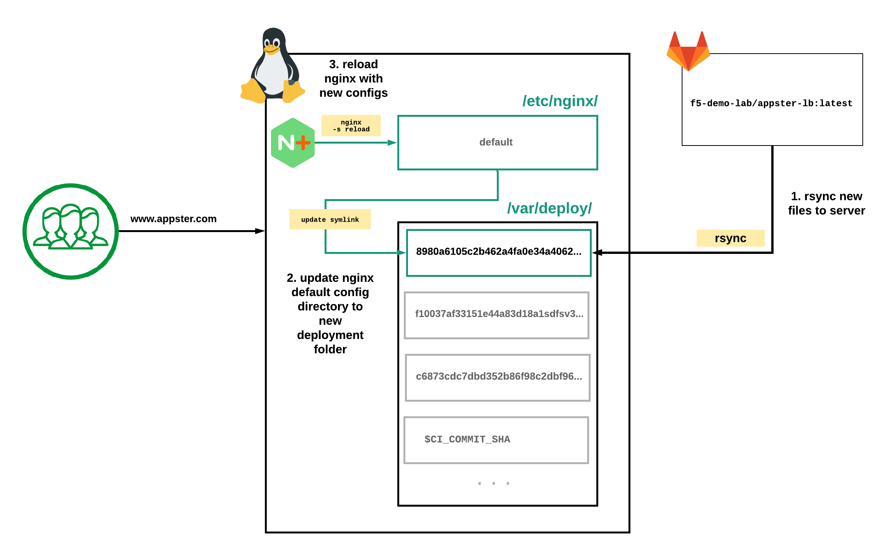
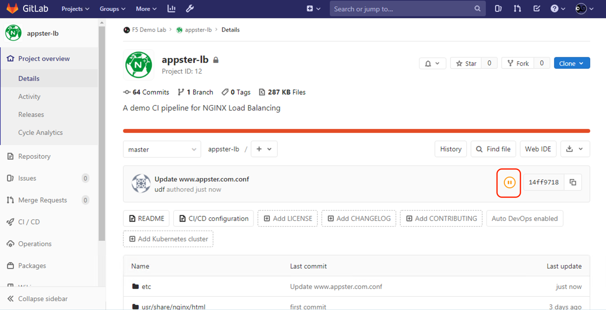
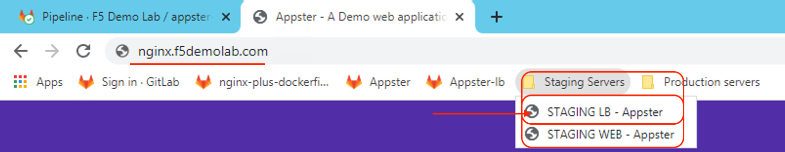
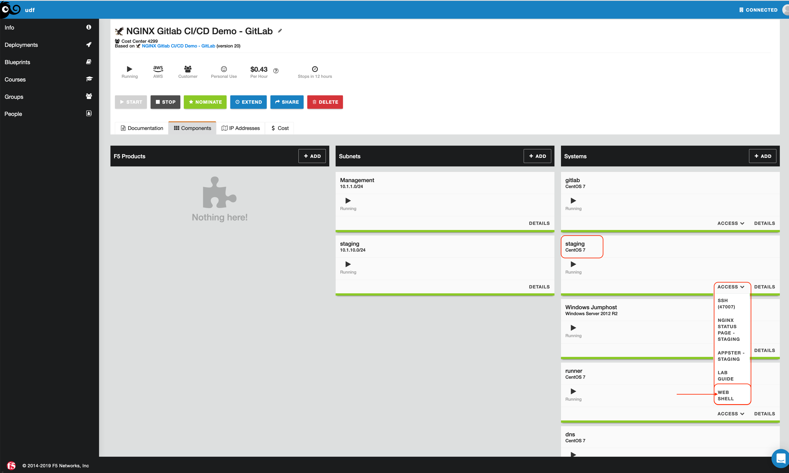

Exercise 3: Continuous Deployment for NGINX Plus Load Balancers
===============================================================

In this exercise, we will be using a CICD pipeline to deploy NGINX Plus
Load balancer.

Instead of deploying NGINX Plus as a container into our live
environments as we did in the previous exercise, we will be pushing new
NGINX configuration into a new deployment folder, the filesystem of our
NGINX Plus Virtual Machine.

Next, we create a [Symbolic link](https://linuxize.com/post/how-to-create-symbolic-links-in-linux-using-the-ln-command/) to
point the default NGINX config directory, `/etc/nginx` to this new
deployment folder, `/var/deploy/[$CI_COMMIT_SHA]`.

Lastly, we will reload NGINX with the new NGINX configuration gracefully
without dropping connections.

The [Commit SHA](https://git-scm.com/book/en/v2/Git-Internals-Git-Objects) is a
unique hash referring to a particular commit of code. Because we deploy
new NGINX Plus configurations in a new folder using a [Commit SHA](https://git-scm.com/book/en/v2/Git-Internals-Git-Objects) as the
folder name, we can quickly revert to known NGINX configuration
consistent with the code commit in Gitlab's git repository.

NGINX can reload a new configuration without any downtime, and without
interrupting any current connections. A soft-reconfiguration spawns a
new set of NGINX worker processes; the old ones continue to work until
completion (but do not accept new requests - all new applications are
accepted by the new set of worker processes). Live binary upgrades work
similarly. If the upgrade is successful, the old set of NGINX worker
processes are signaled to terminate, and the new set takes over. For
more information, please see: [Controlling NGINX](https://nginx.org/en/docs/control.html)

### CICD flowchart

**The diagram below depicts the workflow from code to deployment.** We will deploy new NGINX configuration on the
NGINX Plus Virtual Machine in a three-step process



### Task 1: Make new code commit, push changes to a live running NGINX Plus Virtual Machine

This task will walkthrough steps to configuring and pushing new NGINX
features to a live running NGINX Plus Virtual Machine. In this example
we will enable Rate limiting to our Appster service

1.  Open **GitHub Desktop Client** and s◊itch to the **Current
    repository** to **"appster-lb".** From here we can open the Project
    using the "**Open in Visual Studio Code**" button

    

2.  Open `www.appster.com.conf` and enable rating limiting rule:

    A rate-limiting configuration has been preconfigured in this file and
    **commented out** (**disabled**). To enable rate-limiting, uncomment the
    following lines:

    Uncomment the line with the [`limit_req_zone`](https://nginx.org/en/docs/http/ngx_http_limit_req_module.html#limit_req_zone) directive,
    found near the top of the file, this is in the `http` context, outside the `server` context.
    This line defines our global rate-limiting class:

-   **key** - A parameter, generally a variable, used to differentiate
    one client from another, typically a variable. This our case we are
    using the client's IP
    address, `$binary_remote_addr` note that this variable holds the binary representation of IP address
    which is *shorter than* `$remote_addr`
-   **shared memory zone** - The name and size of the zone that keeps
    states of these keys the "[leaky bucket](https://en.wikipedia.org/wiki/Leaky_bucket)", we have called
    it `limit_me` with the size of 1 megabytes `1m` which can
    store about 16,000 IP addresses (4 bytes for IPv4 addresses, stored
    state occupies 128 bytes on 64-bit platforms.)
-   **rate** - The request rate limit specified in requests per second
    (\`**r/s\`**) or requests per minute (`r/m`). We have initially
    set `10 r/s`

    ```ini
    # Rate limit
    # Uncomment lines below to enable here
    limit_req_zone $binary_remote_addr zone=limit_me:1m rate=10r/s;
    ```

3.  Now we can enable the rate-limiting url on the root location
    (`/`). In the same file, `www.appster.com.conf` , also
    uncomment the lines starting with `limit_req_zone` and
    `limit_req_status` that set:

-   `limit_req` - Applies the rate limiting class as defined the
    zone it references, at this location. In this case we enable the
    rate limiting class `limit_me`
-   `limit_conn_status` - Sets the status code `HTTP 429 "Too many requests"` to return in response to rejected requests.

    ```ini
    # Rate limiting
    # Uncomment below to enable here.
    limit_req_zone=limit_me;
    limit_req_status 429;
    ```

    **Note:** For more info on Limiting Access to Proxied HTTP Resources see: [Limiting the Number of Connections](https://docs.nginx.com/nginxadmin-guide/security-controls/controlling-access-proxied-http/)

    The commented file will look like so:

    

    Remember to **Save** the file after making those changes.

4.  We will see the tracked changes back on the **GitHub Desktop Client**.
    In the lower-left of the GitHub, Desktop Client provide a
    **Commit title** and **note** before we can commit to master.

    You can see two boxes. Go ahead and type in the **title** field: "Enable Rating limiting for Appster.com". 

    Additionally, you can provide notes as well, type in the **notes** field: "Enable 10 request per second in the root '/' location."

    Once you fill in both boxes, click on **Commit to Master** and on
    the next screen, press **"Push to Origin"** to push the new code
    commit to our git repository on Gitlab.

    

    

5.  Open up the **appster-lb** repository on Gitlab by the
    URI, [`https://gitlab.f5demolab.com/f5-demo-lab.appster-lb`](https://gitlab.f5demolab.com/f5-demo-lab.appster-lb) or
    using the **Appster-lb** shortcut provided so we can view the
    pipeline in progress

    The pipeline is automatically triggered, and we can follow its progress
    by clicking the pipeline status icon on the main repo homepage and then
    pipeline status icon on the commit screen.

    

    

    The next screen shows a high-level view of the pipeline triggered for
    this commit. We can click on the pipeline status icon on this screen to
    view the pipeline progress in greater detail.

    Eventually, we will see the pipeline complete. At this stage, the build
    and tests have passed, and we are ready to test on our Staging server.
    After QA testing on our Staging environment, we can decide to deploy to
    Production or proceed to fix issues discovered and iterate on another
    code commit

    

6.  Let's play QA Engineering and do some testing on our Staging
    environment. View our Staging NGINX Plus service in a browser on the
    URI, [`http://nginx.f5demolab.com`](http://nginx.f5demolab.com), or use the
    shortcut, **STAGING LB - Appster**

    

    You will see that rate limiting ten request per second results in
    missing web page content and **broken UI**, worst you may even get a `HTTP 429 Error page`! Not a something we would like to do in production obviously!

    

7.  If you would like to see the rate limiting rule applied against a
    load test, Open an SSH session using **git bash for windows** to our Staging server and run vegeta
    load tester running the following command.

    To open **git bash for windows** again open the **Git Bash** icon on the Windows
    desktop. Git Bash is a bash shell emulator, similar to what you see
    natively on Linux and Unix machines. If the git console font is too
    small to read, use **Ctrl+ "+"** to increase the font

    Once **git bash for windows** is open, run the following command to SSH into the Staging server:

    ```bash
    ssh centos@10.1.1.11
    ```

    

    On the Staging Server go ahead and run the following command to test
    1000 requests per second against the staging NGINX Plus instance
    servicing our Appster web application:

    ```bash
    $ echo "GET http://10.1.1.11" | vegeta attack -rate=1000/s -duration=1s | vegeta report

    Requests [total, rate, throughput] 1000, 1001.47, 10.01
    Duration [total, attack, wait] 998.672ms, 998.536ms, 135.683µs
    Latencies [min, mean, 50, 90, 95, 99, max] 124.393µs, 166.802µs,
    144.693µs, 167.041µs, 179.706µs, 1.133ms, 2.023ms
    Bytes In [total, mean] 349960, 349.96
    Bytes Out [total, mean] 0, 0.00

    Success [ratio] 1.00%
    Status Codes [code:count] 200:10 429:990

    Error Set:
    429 Too Many Requests
    ```

    We should see around ten `HTTP200` requests and the remainder of the request `HTTP429` "Too many requests"`

8.  Play around with the rate-limiting settings until you feel
    comfortable pushing new rate-limiting settings to Production:

    You can edit `etc/nginx/conf.d/www.appster.com.conf` live on the
    Staging server terminal, change the `rate` parameter to a higher number i.e.

     - To edit using `vim` run:

    ```bash
    sudo vim /etc/nginx/conf.d/www.appster.com.conf
    ```

     - Or `nano`:

    ```bash
    sudo nano /etc/nginx/conf.d/www.appster.com.conf
    ```

     - We can change the rate to something much higher, i.e. `10000/rs`

    ```ini
    limit_req_zone $binary_remote_addr zone=limit_me:1m rate=10000r/s;
    ```

     - Remember to save changes to our file
       - In `vim` type `:wq!` to save and quit
       - In `nano` type `CTRL+X` and accept to save changes and quit

    If you did make changes, remember to check the nginx configuration
    syntax then reload NGINX with the new config:

    ```bash
    $ sudo nginx -t && sudo nginx -s reload

    nginx: the configuration file /etc/nginx/nginx.conf syntax is ok
    nginx: configuration file /etc/nginx/nginx.conf test is successful
    ```

9.  We can now rerun the `vegeta` load generator test using the
    same command run in the previous step and view the user experience
    through the web browser

    If you are happy with your testing, commit the new code to our git
    repository and deploy to production!

10. Remember we have purposely left deployment to Production to a human
    trigger, press the **Play button** to deploy the new code to
    Production. We can click on the title to the progress of the
    deployment stage in realtime.

    A **green tick** on this stage indicates a successful deployment and we
    are now live in Production!

    

-------------
> *******************************************
> **Congratulations on completing the lab!**
>
> **Thank you for your interest in the F5/NGINX lab; we hope you have found this lab to be valuable. For more information on NGINX Plus, please visit our [Website](https://www.nginx.com)**
> *******************************************
-------------
### Navigation
> [<= Previous - Exercise 2](../2.0.deploying-nginx-plus-web-server-with-cicd/2.0.deploying-nginx-plus-web-server-with-cicd.md) | 
> [Back to Home =>](../readme.md)